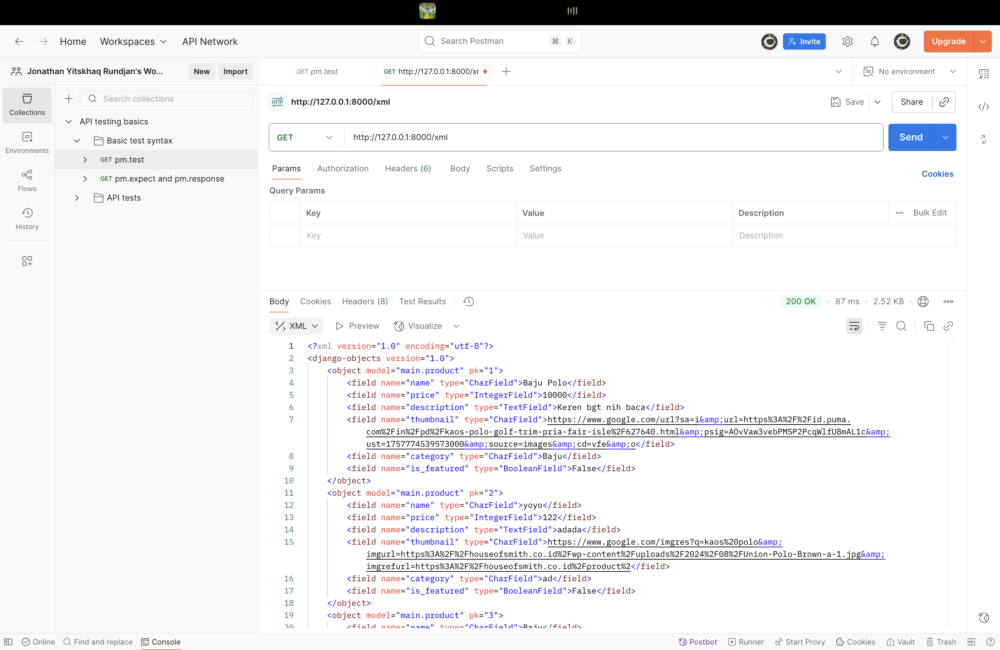
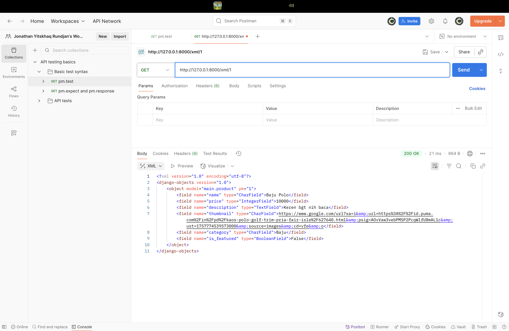
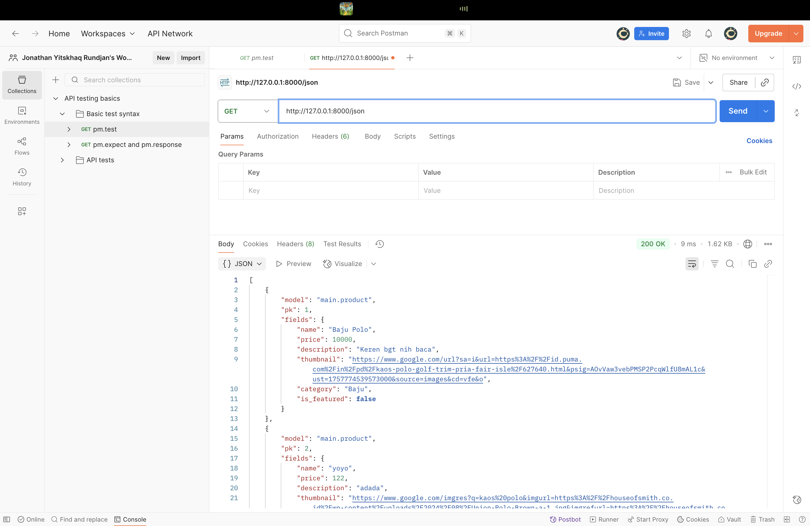
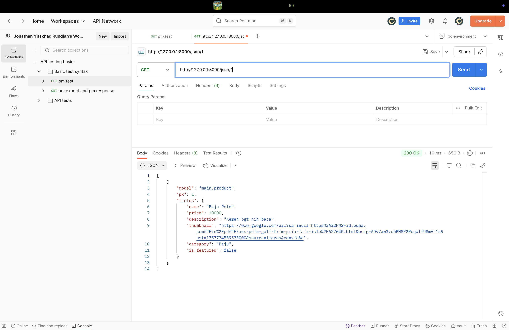

# ⚽ SoccerID — Football Shop Web Application

**Mata Kuliah**: Pemrograman Berbasis Platform (PBP)  
**Semester**: Ganjil 2025/2026  

- 👤 **Nama**: Jonathan Yitskhaq Rundjan  
- 🆔 **NPM**: 2406435231  
- 🏫 **Kelas**: PBP C  
- 🔗 **[Link ke SoccerID](https://jonathan-yitskhaq-soccerid.pbp.cs.ui.ac.id)**

---
## Tugas 3
### Pentingnya Data Delivery dalam sebuah platform
Dalam mengembangkan suatu platform, kita perlu mengirimkan data dari satu stack ke stack lainnya. Hal ini menjadi penting karena: 

1. Pertukaran data yang lebih mudah antara client dan server.

2. Bagian frontend dan backend dapat dikerjakan secara terpisah, sehingga data delivery menjadi hal penting.

3. Data bisa digunakan untuk aplikasi mobile, HTML, dsb.

4. Dapat diakses dan terintegrasi dengan third-party

---
### XML vs JSON, mana yang lebih baik & mengapa JSON lebih populer?

Hal ini bergantung pada kebutuhan developer aplikasi, namun JSON biasanya digunakan karena lebih praktis.

###  Perbedaan JSON vs XML 

| Aspek              | **JSON (JavaScript Object Notation)** | **XML (Extensible Markup Language)** |
|--------------------|----------------------------------------|--------------------------------------|
| **Format**         | Struktur **key–value** (mirip map/dictionary). | Struktur **tree dengan tag** (parent–child elements). |
| **Sintaks**        | Ringkas, mudah dibaca/tulis, tanpa tag penutup. | Verbose, harus pakai tag pembuka/penutup, karakter tertentu perlu entity (`&lt;`, `&gt;`). |
| **Parsing**        | Bisa langsung dengan fungsi JavaScript (`JSON.parse()`), lebih cepat & sederhana. | Butuh XML parser khusus, parsing lebih berat. |
| **Schema**         | Ada JSON Schema, relatif sederhana & fleksibel. | XML Schema (XSD) lebih kompleks & ketat, cocok untuk validasi struktur besar. |
| **Tipe data**      | String, number, object, array, boolean. | Mendukung tipe kompleks tambahan: boolean, date, timestamp, binary, namespace. |
| **Ukuran file**    | Lebih kecil → lebih cepat ditransmisikan. | Lebih besar karena struktur tag. |
| **Kemudahan**      | Simpel, readable, populer di API modern. | Lebih kompleks, verbose, lebih sulit dibaca manusia. |
| **Keamanan**       | Parsing relatif aman. | Rentan ke **XML External Entity (XXE)** atau **DTD attack** jika parser tidak dikonfigurasi dengan aman. |
| **Kapan digunakan**| Cocok untuk API, mobile apps, web apps, data exchange ringan & cepat. | Cocok untuk dokumen kompleks, konfigurasi besar, integrasi enterprise/legacy systems. |

**Kenapa JSON Lebih Populer?**
- Native support di hampir semua bahasa modern
- Sintaks mudah dipahami dan lebih sederhana
- Memiliki ukuran data yang lebih kecil


---
### Peran `is_valid()` dalam Django Form
`settings.py` dalam  Django Form berfungsi untuk: 
- Mengecek validasi bawaan.
- Mengembalikan `True` `False` sesuai dengan data.
- Setelah `is_valid()` dipanggil, kita bisa mengakses `form.celaned_data` untuk mengambil data yang sudah bersih.


---
### Mengapa perlu `` pada form? Apa risikonya jika tidak? 

1. Proteksi CSRF: token unik dimasukkan ke form lalu diverifikasi di server.
2. Tanpa token, seorang hacker bisa melakukan **Cross-Site Request Forgery** yang mmembuat halaman berisi form tersebunyi yang auto-submit menggunakan cookie korban.
3. Dengan token, request palsu bisa dihindari.

Seluruh proses ini bertujuan untuk memastikan struktur database pada program sinkron dengan model yang telah didefinsikan.

---
### Step-by-step Implementasi Checklist

1. **Setup proyek & app**
   - Buat virtual environment: `python -m venv env` lalu aktifkan.
   - Install Django: `pip install django`.
   - Buat proyek: `django-admin startproject SoccerID`.
   - Buat app: `python manage.py startapp main`.
   
2. **Membuat Model `Product`**
   - Field yang digunakan:
     - `name` (CharField)
     - `price` (IntegerField)
     - `description` (TextField)
     - `thumbnail` (URLField)
     - `category` (CharField)
     - `is_featured` (BooleanField)
   - Jalankan `python manage.py makemigrations` dan `python manage.py migrate`.

3. **Membuat Form**
   - Tambahkan `ProductForm` (ModelForm) di `forms.py` agar field di atas otomatis terbentuk input HTML.

4. **Membuat Views**
   - `show_main` → menampilkan semua produk dalam template `main.html`.
   - `add_product` → menampilkan form tambah produk dan menyimpan ke database jika valid.
   - `product_detail` → menampilkan detail produk tertentu.
   - `show_json`, `show_xml`, `show_json_by_id`, `show_xml_by_id` → mengembalikan data dalam format JSON atau XML.

5. **Routing**
   - `SoccerID/urls.py` → gunakan `include("main.urls")`.
   
6. **Membuat Templates**
   - `add_product.html` → halaman form tambah produk (gunakan ``).
   - `product_detail.html` → halaman detail produk.

7. **Migrasi Database**
   - Menjalankan `python manage.py makemigrations` dan `python manage.py migrate`.

7. **Testing dan Deployment**
   - Jalankan `python manage.py runserver`.
   - Men-deploy ke PWS.


---
### Feedback untuk Asisten Dosen
Menurut saya, bantuan asisten dosen hingga saat ini sudah sangat cukup membantu bagi saya.

---
###  Bukti Screenshoot Postman
Postman XML

Postman XML by ID

Postman JSON

Postman JSON by ID


### Referensi
Pada pembuatan model, saya menggunakan GPT untuk memberikan bentuk model terbaik dan penempatan size yang sesuai. 

---

## Tugas 4
### Pengertian Django `AuthenticationForm`, Kelebihan dan Kekurangan

AuthenticationForm` adalah form bawaan Django untuk autentikasi username dan password.  

**Kelebihan:**
- Siap pakai, validasi sudah tersedia.
- Terintegrasi dengan sistem auth Django (`authenticate`, `login`).
- Aman secara default (hashing password).

**Kekurangan:**
- Tampilan standar, perlu di-custom agar lebih user-friendly.
- Hanya mendukung username/password, login via email/OTP harus form custom.
- Tidak ada fitur tambahan seperti “remember me” atau 2FA.

## Perbedaan Autentikasi dan Otorisasi
- **Autentikasi** → proses verifikasi identitas (*siapa kamu*).  
  Django: `AuthenticationMiddleware`, `authenticate()`, `login()`, `logout()`.
- **Otorisasi** → proses menentukan hak akses (*boleh ngapain*).  
  Django: `user.is_staff`, `user.is_superuser`, `user.has_perm()`, decorator `@permission_required`.

**Contoh:**
```python
from django.contrib.auth.decorators import login_required, permission_required

@login_required
def dashboard(request):
    ...

@permission_required('main.change_product', raise_exception=True)
def edit_product(request, pk):
    ...
```

## Kelebihan & Kekurangan Session dan Cookies
**Session (server-side)**
- Kelebihan: Data state aman di server, tidak terkena batas 4KB, bisa invalidasi/ rotasi, lebih sulit untuk dimanipulasi user.
- Kekurangan: Perlu storage, skalabilitas (replication), overhead query.

---
**Cookies (client-side)**
- Kelebihan: Stateless di server, cepat, dan hemat storage server.
- Kekurangan: Batas ukuran 4KB, rentan untuk dimodifikasi jika tidak terenkripsi, rawan XSS/mitm jika tak pakai Secure/ HtppOnly, sinkronisasi & invalidasi lebih sulit

---
## Apakah Cookies "Aman secara Default"? Risiko dan Mitigasi Django

Secara umum, Cookies tidak otomatis aman. Risiko yang umum: 
- XSS: Pencurian cookie/ session.
- Tanpa HTTPS: Cookie bisa disadap.
- CSRF: Request palsu memakai cookie sesi korban.
- Session Fixation: Penyerang memaksa korban memakai session ID tertentu.

**Mitigasi Keamanan di Django (Production Hardening)**

Tambahkan pengaturan berikut pada `settings.py` (khusus mode produksi):

```python
# settings.py (production hardening)

# Cookie hanya dikirim via HTTPS
SESSION_COOKIE_SECURE = True
CSRF_COOKIE_SECURE = True

# Cookie tidak bisa diakses JavaScript (hindari XSS)
SESSION_COOKIE_HTTPONLY = True
# CSRF_COOKIE_HTTPONLY = True   # aktifkan jika tidak perlu akses token via JS

# Batasi pengiriman cookie hanya untuk same-site request
SESSION_COOKIE_SAMESITE = "Lax"   # atau "Strict" sesuai kebutuhan
CSRF_COOKIE_SAMESITE = "Lax"

# Paksa semua request ke HTTPS
SECURE_SSL_REDIRECT = True

# (Opsional) Rotasi sesi setelah login untuk cegah session fixation
# di view login: request.session.flush() atau django.contrib.auth.login() otomatis rotate session
```

---
### Step-by-step Implementasi Checklist

1. **Membuat Model & Migrasi**
   - Buat `Product` dengan field: `name, price, description, thumbnail, category, stock, is_featured, user`.
   - Menjalankan `makemigrations` + `migrate`

2. **Form**
   - `ProductForm` (ModelForm) hanya mencakup field produk tanpa `user`

3. **Views HTML**
   - Membuat agar bisa memfilter berdasarkan product user yaitu my product dan all product

4. **Auth**
   - Register: `UserCreationForm`
   - Login: `AuthenticationForm`, `login()`, set cookie `last_login`
   - Logout: `logout()`, hapus cookie `last_login`
   
5. **Keamanan**
   - Gunakan `` di semua form.
   - Set `ALLOWED_HOSTS`, `CSRF_TRUSTED_ORIGINS`, dan cookie secure saat deploy.

---
## Tugas 5

### Urutan Prioritas CSS Selector
Jika beberapa CSS selector mengenai elemen HTML yang sama, prioritasnya diatur oleh **specificity** (dari tertinggi ke terendah):
- **Inline style** (`style=""`) paling tinggi.
- **ID selector** (`#id`) lebih tinggi daripada class.
- **Class, pseudo-class, attribute selector** (`.class`, `:hover`, `[attr]`) lebih tinggi daripada tag selector.
- **Tag/element selector** (`div`, `p`) paling rendah.
- Jika specificity sama, aturan yang muncul **terakhir** di file CSS yang digunakan yang menang.
- `!important` pada aturan yang sama origin-nya akan mengalahkan aturan biasa.


### Pentingnya Responsive Design
Responsive design penting agar tampilan web menyesuaikan berbagai ukuran layar (mobile, tablet, desktop) sehingga:
1. UX lebih baik: tidak perlu zoom/scroll horizontal, navigasi mudah.
2. Akses lebih luas: nyaman di semua perangkat.
3. SEO: mendukung mobile-first indexing & Core Web Vitals.
4. Maintainability: satu basis CSS untuk berbagai viewport.

**Contoh:**
* **Sudah responsif**: GitHub / Medium / Airbnb (navbar adaptif, grid berubah kolom, font/gambar fluid).
* **Belum/buruk responsif (pola umum)**: situs lama fixed-width (960px), perlu zoom, scroll horizontal di ponsel, tabel melebar.


### Perbedaan Margin, Border, Padding
- **Margin**: ruang di luar border elemen, memisahkan antar elemen.
- **Border**: garis tepi di antara padding dan margin.
- **Padding**: ruang di dalam elemen antara content dan border.

Implementasi:
```css
.card {
  width: 320px;
  background: #fff;

  border: 1px solid #e5e7eb;  /* BORDER */
  padding: 16px;               /* PADDING (di dalam border) */
  margin: 12px;                /* MARGIN (di luar border) */

  border-radius: 12px;
}
```

### Flexbox vs Grid Layout

- **Flexbox**: 1 dimensi, baris atau kolom. Cocok untuk navbar, toolbar, alignment vertikal/horizontal, list yang perlu wrap.

- **Grid**: mengatur layout dalam dua dimensi (row + column). Cocok untuk dashboard, galeri, atau tata letak kompleks.

```css
C.gallery {
  display: grid;
  gap: 12px;
  grid-template-columns: repeat(auto-fit, minmax(180px, 1fr));
}
```

### Implementasi Checklist Step-by-Step
1. **Tambahkan CSS Framework**  
   Menggunakan TailwindCSS untuk styling halaman

2. **Gunakan Flexbox di Bagian yang Sederhana**  
   - Navbar: elemen menu dibuat sejajar horizontal dengan `flex`.
   - Tombol pada card: menggunakan `flex` untuk mengatur tombol edit dan hapus sejajar.

3. **Gunakan Grid di Layout **  
   - Halaman daftar product: susun card product dalam grid (`grid grid-cols-3` di Tailwind misalnya).

4. **Test Responsif**  
   - Periksa di ukuran layar mobile dan desktop.

NOTES : Pada pengerjaan Tugas 5 saya dibantu oleh AI untuk design dan memahami syntax yang ada

---
## Tugas 6
### Perbedaan antara synchronous request dan asynchronous request

**Synchronous Request:**
- Eksekusi kode berjalan secara berurutan (blocking)
- Browser akan "freeze" atau tidak responsif saat menunggu response dari server
- Halaman web tidak dapat berinteraksi dengan user sampai request selesai
- Contoh: Form submission biasa yang menyebabkan page reload

**Asynchronous Request:**
- Eksekusi kode tidak memblokir proses lainnya (non-blocking)
- Browser tetap responsif dan user dapat berinteraksi dengan halaman
- Request dikirim di background, dan response akan diproses ketika tersedia
- Contoh: AJAX request yang mengupdate data tanpa reload halaman

**Ilustrasi Perbedaan:**
```javascript
// Synchronous (blocking)
const result = expensiveOperation(); // Halaman freeze
console.log(result);

// Asynchronous (non-blocking)
fetch('/api/data')
  .then(response => response.json())
  .then(data => console.log(data)); // Halaman tetap responsif
console.log('Request sent'); // Ini dijalankan dulu sebelum data diterima
```

---

### Bagaimana AJAX bekerja di Django (alur request–response)

**Alur Kerja AJAX di Django:**

1. **Client-Side (JavaScript):**
   - User melakukan aksi (klik button, submit form, dll)
   - JavaScript menangkap event tersebut
   - Membuat AJAX request menggunakan `fetch()` atau `XMLHttpRequest`
   - Mengirim data dalam format JSON ke endpoint Django

2. **Server-Side (Django):**
   - Django menerima request di view function yang sesuai dengan URL
   - View memproses data (validasi, manipulasi database, dll)
   - View mengembalikan response dalam format JSON menggunakan `JsonResponse`

3. **Client-Side (JavaScript - Response):**
   - JavaScript menerima response dari server
   - Parse JSON response
   - Update DOM secara dinamis tanpa reload halaman
   - Tampilkan feedback ke user (toast notification, dll)

---

### Keuntungan menggunakan AJAX dibandingkan render biasa di Django

**Keuntungan AJAX:**

1. **User Experience Lebih Baik:**
   - Tidak ada page reload yang mengganggu
   - Interaksi terasa lebih smooth dan cepat
   - Loading hanya pada bagian yang dibutuhkan

2. **Performa Lebih Efisien:**
   - Hanya transfer data yang diperlukan (JSON) bukan seluruh HTML
   - Bandwidth lebih hemat
   - Server load lebih ringan karena tidak perlu render template

3. **Responsivitas Tinggi:**
   - User dapat tetap berinteraksi dengan halaman saat request berlangsung
   - Multiple request dapat dilakukan secara bersamaan
   - Real-time updates dapat dilakukan dengan mudah

4. **Separation of Concerns:**
   - Backend fokus pada data dan logic (API)
   - Frontend fokus pada presentation dan UX
   - Lebih mudah untuk maintenance dan scaling

5. **Modern Web Development:**
   - Mendukung Single Page Application (SPA)
   - Lebih mudah untuk integrasi dengan mobile apps
   - API dapat digunakan ulang untuk berbagai platform


### Cara memastikan keamanan saat menggunakan AJAX untuk fitur Login dan Register di Django

**Praktik Keamanan AJAX:**

1. **CSRF Protection:**
   ```javascript
   // Selalu sertakan CSRF token di header
   headers: {
       'X-CSRFToken': getCookie('csrftoken')
   }
   ```
   - Django secara default memerlukan CSRF token untuk POST request
   - Token ini mencegah Cross-Site Request Forgery attacks

2. **HTTPS (SSL/TLS):**
   - Gunakan HTTPS untuk enkripsi data saat transit
   - Hindari man-in-the-middle attacks
   - Wajib untuk aplikasi production

3. **Input Validation:**
   ```python
   # Server-side validation
   if len(password) < 8:
       return JsonResponse({
           'status': 'error',
           'message': 'Password too short'
       }, status=400)
   ```
   - Validasi di server, tidak cukup hanya di client
   - Sanitize input untuk mencegah SQL Injection
   - Validasi tipe data dan format

4. **Authentication & Authorization:**
   ```python
   @login_required
   def protected_view(request):
       # Verify user has permission
       if product.user != request.user:
           return JsonResponse({'error': 'Unauthorized'}, status=403)
   ```

5. **Rate Limiting:**
   - Batasi jumlah request per IP/user
   - Cegah brute force attacks
   - Gunakan library seperti `django-ratelimit`

6. **Secure Password Handling:**
   - Jangan pernah kirim plain password di response
   - Django secara default menggunakan PBKDF2 untuk hash password
   - Gunakan password validators Django

7. **Content Security Policy (CSP):**
   - Set header CSP untuk mencegah XSS attacks
   - Batasi sumber JavaScript yang dapat dieksekusi

8. **Error Handling:**
   ```python
   # Jangan expose sensitive info di error message
   return JsonResponse({
       'status': 'error',
       'message': 'Invalid credentials'  # Generic message
   })
   ```
---

### Bagaimana AJAX mempengaruhi pengalaman pengguna (User Experience) pada website

**Dampak Positif AJAX terhadap UX:**

1. **Interaksi Lebih Smooth:**
   - Tidak ada "white flash" saat page reload
   - Transisi antar state lebih halus

2. **Feedback Instant:**
   - Validasi real-time
   - Toast notifications yang tidak mengganggu

3. **Perceived Performance:**
   - Website terasa lebih cepat
   - User dapat melanjutkan interaksi saat loading

4. **Multi-tasking:**
   - User dapat melakukan beberapa aksi sekaligus
   - Background operations tidak menghalangi interaksi

5. **State Preservation:**
   - Form input tidak hilang
   - Scroll position dipertahankan

---