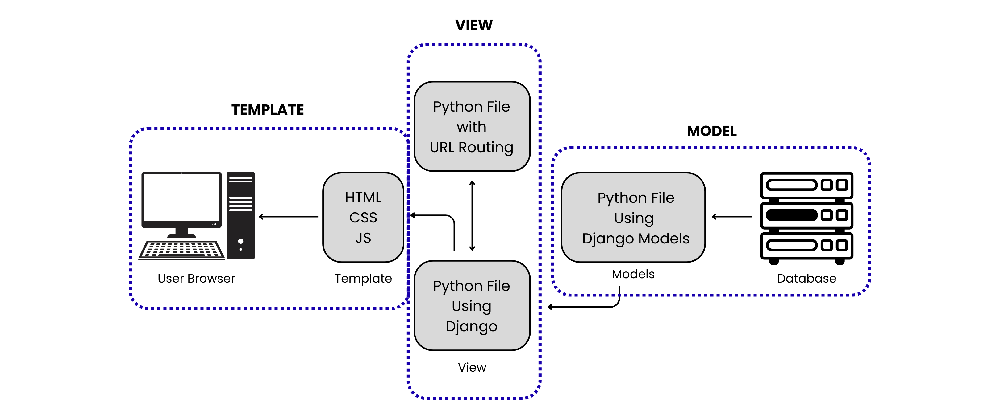

# ⚽ SoccerID — Football Shop Web Application

**Mata Kuliah**: Pemrograman Berbasis Platform (PBP)  
**Semester**: Ganjil 2025/2026  

- 👤 **Nama**: Jonathan Yitskhaq Rundjan  
- 🆔 **NPM**: 2406435231  
- 🏫 **Kelas**: PBP C  
- 🔗 **[Link ke SoccerID](https://jonathan-yitskhaq-soccerid.pbp.cs.ui.ac.id)**

---

## ✅ Implementasi Checklist (Step by Step)

1. **Setup Project**
   - Membuat virtual environment dan menginstall Django 
   - Membuat proyek Django baru dengan perintah: `django-admin startproject soccerid`
   - membuat aplikasi utama main: `python manage.py startapp main`
   - menambahkan main ke dalam `INSTALLED_APPS` di `settings.py`

2. **Membuat Model**  
   - Membuat model `Product` dengan atribut `name`, `price`,   `description`, `thumbnail`, `category`, dan `is_featured`
   - menambahkan atribut tambahan lainnya yang dibutuhkan.  

3. **Membuat Views dan Routing**  
   - Menambahkan function/class di `views.py` untuk menampilkan nama aplikasi serta identitas.  
   -Membuat `urls.py` di aplikasi main untuk memetakan URL ke fungsi views.  

4. **Membuat Template HTML**  
   - Menyediakan folder `templates/` khusus untuk file HTML.
   - Memanfaatkan template engine Django `({{ ... }})` untuk merender data dari view ke halaman web.

5. **Migrasi Database**  
   - Menjalankan `python manage.py makemigrations` dan `python manage.py migrate`.

6. **Testing dan Deployment**  
   - Menjalankan server lokal (`python manage.py runserver`).  
   - Deploy ke PWS 

---
## Bagan Alur Request-Response

### Penjelasan
- **`urls.py`** → menentukan path URL yang akan digunakan ke fungsi yang sesuai di **`views.py`**.  
- **`views.py`** → mengambil dan mengolah data yang diperlukan dari **`models.py`**.  
- **`models.py`** → mendefinisikan struktur data dan model pada aplikasi.  
- **Template HTML** → menampilkan data ke user melalui tampilan website.  

---
## Peran `settings.py` dalam proyek Django
`settings.py` dalam proyek Django berfungsi sebagai pusat konfigurasi proyek Django, meliputi: 
- Daftar aplikasi aktif (INSTALLED_APPS) 
- Konfigurasi database 
- Middleware Static files & template directories. 
- Konfigurasi Deployment

---
## Cara Kerja Migrasi Database di Django

1. mendefinisikan model di dalam `models.py` 
2. Membuat file migrasi dengan menjalankan `python manage.py makemigrations`. 
3. Menerapkan migrasi ke database dengan menjalankan `python manage.py migrate`. 

Seluruh proses ini bertujuan untuk memastikan struktur database pada program sinkron dengan model yang telah didefinsikan.

---
## Mengapa Django cocok sebagai Framework untuk Pemula?
1. Framework Django menggunakan Python sehingga lebih mudah dipahami sebagai seorang pemula 
2. Django menggunakan pola MVT yang jelas dan terstruktur. 
3. Dapat banyak mempelajari konsep dasar web development seperti routing, template, ORM, dan lain sebagainya.

---
## Feedback untuk Asisten Dosen
Menurut saya, bantuan asisten dosen hingga saat ini sudah sangat cukup membantu bagi saya.